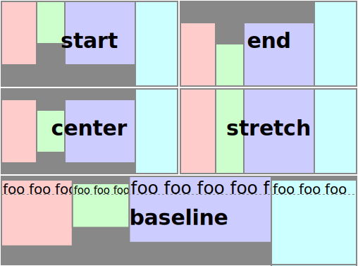

[evokit]: /packages/evokit/

[css-variable-usage]: //w3schools.com/css/css3_variables.asp
[html-all-tags]: //www.w3schools.com/tags/default.asp

[installation]: /docs/getting-started/installation.md
[quik-start]: /docs/getting-started/quick-start.md
[use-props]: /docs/getting-started/props.md

[flex-tag]: #flex-tag
[flex-item-tag]: #flex-item-tag

[flex-display]: #flex-display
[flex-align-content]: #flex-align-content
[flex-align-items]: #flex-align-items
[flex-align-self]: #flex-align-self
[flex-justify-content]: #flex-justify-content
[flex-direction]: #flex-direction
[flex-wrap]: #flex-wrap

# EvoKit - Flex

[](https://www.npmjs.com/package/evokit-flex)

<!--
[](https://www.npmjs.com/package/evokit)
-->

The Flex block has an essential role in building layouts

---

!> THE ALPHA VERSION OF THE PACKAGE IS RECOMMENDED FOR REFERENCE ONLY. DO NOT USE IN PRODUCTION!

## Install

> Peer dependencies [evokit]. More about [install][installation]

```bash
npm install evokit-flex --save
```

## Usage

> More about [usage][quik-start]

```jsx
import { Flex, FlexItem } from 'evokit-flex';
import 'evokit-flex/style.css';

<Flex>
    <FlexItem>...</FlexItem> // some <Flex.Item>...<Flex.Item>
</Flex>

```

## Props

> Also supports other valid props of the React Element. More about [use props][use-props]. More about [use props][use-props]

### `<Flex />`

| Prop name        | Default value    | Possible value | Description |
|------------------|------------------|----------------|-------------|
| [flex-tag]       | `div`         | [html tags][html-all-tags] | HTML tag    |
| [flex-display]   | `flex`     | `flex` `flex-inline` `block` `none` | Display type |
| flex-content     | `start`    | `start` `end` `center` `between` `around` `stretch` | Space between flex lines on the cross axis |
| flex-items       | `start`    | `start` `end` `center` `baseline` `stretch` | Alignment of all items on the cross axis |
| [flex-direction] | `row`      | `row` `row-reverse` `column` `column-reverse` | Direction of all items |
| [flex-wrap]      | `wrap`   | `nowrap` `wrap` `wrap-reverse` | Wrap rules |

### `<FlexItem />`

| Prop name        | Default value    | Possible value | Description |
|------------------|------------------|----------------|-------------|
| [flex-item-tag]  | `div`         | [html tags][html-all-tags] | HTML tag    |
| flex-item-align  | `start`    | `start` `end` `center` `baseline` `stretch` | Alignment item on the cross axis |

## Customize

> This set of css variables is default, if you want to override one or more value, please use the rules [css-variable-usage], define them below the css import.

```css
@custom-media --ek-flex-media-small only screen and (min-width: 480px);
@custom-media --ek-flex-media-medium only screen and (min-width: 768px);
@custom-media --ek-flex-media-large only screen and (min-width: 960px);
@custom-media --ek-flex-media-wide only screen and (min-width: 1200px);
@custom-media --ek-flex-media-huge only screen and (min-width: 1400px);
```

## Live demo

[](https://codesandbox.io/embed/flex-usage-d85tn?fontsize=14 ':include :type=iframe width=100% height=500px')

---

## `flex-tag`

Default value `div`

```jsx
<Flex flex-tag='div'>
    ...
</Flex>
```

## `flex-item-tag`

Default value `div`

```jsx
<Flex>
    <FlexItem flex-item-tag='div'>
        ...
    </FlexItem>
</Flex>
```

## `flex-display`

```jsx
<Flex flex-display='flex-inline'>
    ...
</Flex>
```

## `flex-align-content`

- `start` - Lines are packed toward the start of the flex container
- `end` - Lines are packed toward the end of the flex container
- `center` - Lines are packed toward the center of the flex container
- `between` - Lines are evenly distributed in the flex container. If the leftover free-space is negative or there is only a single flex line in the flex container, this value is identical to flex-start
- `around` - Lines are evenly distributed in the flex container, with half-size spaces on either end
- `stretch` - Lines stretch to take up the remaining space


```jsx
<Flex flex-align-content='center'>
    ...
</Flex>
```

## `flex-align-items`

- `start` - The cross-start margin edges of the flex items are flushed with the cross-start edge of the line
- `end` - The cross-end margin edges of the flex items are flushed with the cross-end edge of the line
- `center` - The flex items' margin boxes are centered within the line on the cross-axis
- `baseline` - All flex items are aligned such that their flex container baselines align
- `stretch` - Flex items are stretched such that the cross-size of the item's margin box is the same as the line while respecting width and height constraints



```jsx
<Flex flex-align-items='center'>
    ...
</Flex>
```

## `flex-align-self`

- `start` - The cross-start margin edges of the flex item are flushed with the cross-start edge of the line
- `end` - The cross-end margin edges of the flex item are flushed with the cross-end edge of the line
- `center` - The flex item' margin boxes are centered within the line on the cross-axis
- `baseline` - All flex item are aligned such that their flex container baselines align
- `stretch` - Flex item are stretched such that the cross-size of the item's margin box is the same as the line while respecting width and height constraints


```jsx
<Flex flex-align-self='center'>
    ...
</Flex>
```

## `flex-justify-content`

- `start` - Flex items are packed toward the start of the line
- `end` - Flex items are packed toward the end of the line
- `center` - Flex items are packed toward the center of the line
- `between` - Flex items are evenly distributed in the line
- `around` - Flex items are evenly distributed in the line, with half-size spaces on either end


```jsx
<Flex flex-justify-content='center'>
    ...
</Flex>
```

## `flex-direction`

- `row` - The flex container’s main axis has the same orientation as the inline axis of the current writing mode
- `row-reverse` - Same as row, except the main-start and main-end directions are swapped
- `column` - The flex container’s main axis has the same orientation as the block axis of the current writing mode
- `column-reverse` - Same as column, except the main-start and main-end directions are swapped


```jsx
<Flex flex-direction='column'>
    ...
</Flex>
```

## `flex-wrap`

- `nowrap` - The flex container is single-line
- `wrap` - The flex container is multi-line
- `wrap-reverse` - Same as wrap, except the directions are swapped


```jsx
<Flex flex-wrap='wrap'>
    ...
</Flex>
```
