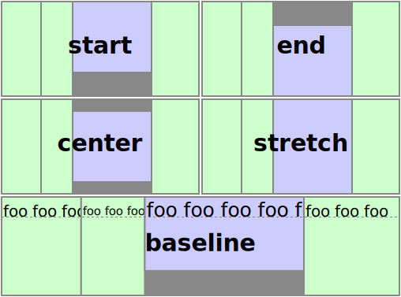

[evokit]: /packages/evokit/
[CHANGELOG]: /packages/evokit-flex/CHANGELOG.md

[css-variable-usage]: //w3schools.com/css/css3_variables.asp

[installation]: /docs/getting-started/installation.md
[quik-start]: /docs/getting-started/quick-start.md
[use-props]: /docs/props/base.md

[flex-align-self]: #flex-align-self
[flex-content]: #flex-content
[flex-direction]: #flex-direction
[flex-display]: #flex-display
[flex-height]: #flex-height
[flex-items]: #flex-items
[flex-wrap]: #flex-wrap

[flex-item-align]: #flex-item-align
[flex-item-display]: #flex-item-display
[flex-item-order]: #flex-item-order
[flex-item-empty]: #flex-item-empty

# EvoKit - Flex

[](https://www.npmjs.com/package/evokit-flex)
[][CHANGELOG]

<!--
[](https://www.npmjs.com/package/evokit)
-->

The block for building flexible layouts. Contains two elements `<Flex>` and `<Flex.Item>`

---

## Install

> Peer dependencies [evokit]. More about [install][installation]

```bash
npm install evokit-flex --save
```

## Usage

> More about [usage][quik-start]

```jsx
import React from 'react';
import { Flex } from 'evokit-flex';
import 'evokit-flex/style.css';

const App = () => (
    <Flex flex-content='center'>
        <Flex.Item>...</Flex.Item>
    </Flex>
);
```

[](https://codesandbox.io/embed/flex-usage-d85tn?fontsize=14&runonclick=0 ':include :type=iframe width=100% height=500px')

## Props

> Also supports other valid props of the React Element. More about [use props][use-props]

### `<Flex />`

| Prop name          | Default value    | Possible value | Description |
|--------------------|------------------|----------------|-------------|
| [flex-content] `*` | `start`    | `start` `end` `center` `between` `around` `stretch` | Space between flex lines on the cross axis |
| [flex-direction]   | `row`      | `row` `row-reverse` `column` `column-reverse` | Direction of all items |
| [flex-display]     | `flex`     | `flex` `inline-flex` `none` | Display type |
| [flex-height]      | `auto`     | `auto` `inherit` `1-1`     | Set the height |
| [flex-items]       | `start`    | `start` `end` `center` `baseline` `stretch` | Alignment of all items on the cross axis |
| [flex-wrap]        | `wrap`     | `nowrap` `wrap` `wrap-reverse` | Wrap rules |

### `<Flex.Item />`

| Prop name           | Default value    | Possible value | Description |
|---------------------|------------------|----------------|-------------|
| [flex-item-align]   | `start`  | `start` `end` `center` `baseline` `stretch` | Alignment item on the cross axis |
| [flex-item-display] | `block`  | `block` `none` | Display type |
| [flex-item-empty]   | `null`   | `hidden` | Hide if contain either nothing or only an HTML comment. |
| [flex-item-order]   | `null`   | `0` `1` `2` `3` `4` `5` `6` `7` `8` `9` `10` | Set the order |

> `*` — prop has advanced params

## Customize

> This set of css variables is default, if you want to override one or more value, please use the rules [css-variable-usage], define them below the css import.

```css
@custom-media --ek-flex-media-small only screen and (min-width: 480px);
@custom-media --ek-flex-media-medium only screen and (min-width: 768px);
@custom-media --ek-flex-media-large only screen and (min-width: 960px);
@custom-media --ek-flex-media-wide only screen and (min-width: 1200px);
@custom-media --ek-flex-media-huge only screen and (min-width: 1400px);
```

---

## `flex-display`

```jsx
<Flex flex-display='inline-flex'>
    ...
</Flex>
```

## `flex-items`

- `start` - The cross-start margin edges of the flex items are flushed with the cross-start edge of the line
- `end` - The cross-end margin edges of the flex items are flushed with the cross-end edge of the line
- `center` - The flex items' margin boxes are centered within the line on the cross-axis
- `baseline` - All flex items are aligned such that their flex container baselines align
- `stretch` - Flex items are stretched such that the cross-size of the item's margin box is the same as the line while respecting width and height constraints


```jsx
<Flex flex-items='center'>
    ...
</Flex>
```

## `flex-content`

**Advanced props**

1. `flex-content-align`
2. `flex-content-justify`

**Multi values** _(set value separated by a space)_

- `flex-content="{1} {2}"`

**List of values**

- `start` - Lines are packed toward the start of the flex container
- `end` - Lines are packed toward the end of the flex container
- `center` - Lines are packed toward the center of the flex container
- `between` - Lines are evenly distributed in the flex container. If the leftover free-space is negative or there is only a single flex line in the flex container, this value is identical to flex-start
- `around` - Lines are evenly distributed in the flex container, with half-size spaces on either end
- `stretch` - Lines stretch to take up the remaining space

| flex-content | flex-content-align | flex-content-justify |
|------------- |--------------------|----------------------|
|  |  |  |

## `flex-direction`

- `row` - The flex container’s main axis has the same orientation as the inline axis of the current writing mode
- `row-reverse` - Same as row, except the main-start and main-end directions are swapped
- `column` - The flex container’s main axis has the same orientation as the block axis of the current writing mode
- `column-reverse` - Same as column, except the main-start and main-end directions are swapped


```jsx
<Flex flex-direction='column'>
    ...
</Flex>
```

## `flex-wrap`

- `nowrap` - The flex container is single-line
- `wrap` - The flex container is multi-line
- `wrap-reverse` - Same as wrap, except the directions are swapped


```jsx
<Flex flex-wrap='wrap'>
    ...
</Flex>
```

## `flex-height`

Set the height

- `auto` - value: `auto`
- `inherit` - value: `inherit`
- `1-1` - value: `100%`

```jsx
<Flex flex-height='1-1'>
    ...
</Flex>
```

## `flex-item-align`

- `start` - The cross-start margin edges of the flex item are flushed with the cross-start edge of the line
- `end` - The cross-end margin edges of the flex item are flushed with the cross-end edge of the line
- `center` - The flex item' margin boxes are centered within the line on the cross-axis
- `baseline` - All flex item are aligned such that their flex container baselines align
- `stretch` - Flex item are stretched such that the cross-size of the item's margin box is the same as the line while respecting width and height constraints



```jsx
<Flex flex-item-align='center'>
    ...
</Flex>
```

## `flex-item-display`

- `block` - shown as blocky (default)
- `none` - remove block from document

```jsx
<Flex>
    <Flex.Item flex-item-display='none'>
        ...
    </Flex.Item>
</Flex>
```

## `flex-item-order`

- `0, 1, 2, 3, 4, 5, 6, 7, 8, 9, 10` - only affects the visual order

```jsx
<Flex>
    <Flex.Item flex-item-order='2'>
        ...
    </Flex.Item>
</Flex>
```

## `flex-item-empty`

The `<Flex.Item>` will be hidden `display: none` that contain either nothing or only an HTML comment.

```jsx
<Flex>
    <Flex.Item flex-item-empty='hidden'>
        {null}
    </Flex.Item>
</Flex>
```
